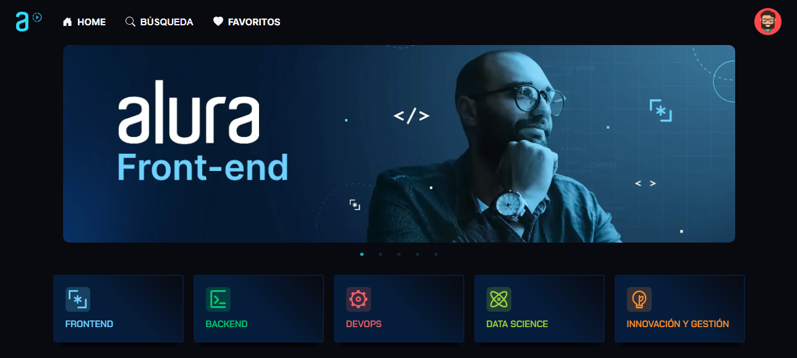

# Aluraplus

  </img>

- [Aluraplus](#aluraplus)
  - [Descripción](#descripción)
    - [Desafío](#desafío)
  - [Mi Procedimiento](#mi-procedimiento)
    - [Construido con](#construido-con)
    - [Lo que aprendí](#lo-que-aprendí)
    - [Recursos útiles](#recursos-útiles)
  - [Autor](#autor)

## Descripción

### Desafío

Este sitio es una mutación del desafío Aluraflix de Alura Latam para el curso de frontend del Grupo 5. Se modifico el diseño y se agregaron funcionalidades. En él tendrás sugerencias de videos de Alura separados por formación.

Sus usuarios deberían poder:

- Ver el diseño óptimo según el tamaño de la pantalla de su dispositivo
- Ver estados de desplazamiento para elementos interactivos
- Agregar, editar y borrar videos o formaciones
- Marcar videos como favoritos
- Realizar una búsqueda (pendiente)

## Mi Procedimiento

### Construido con

- Styled Components
- React
- React Slick
- React Icons
- React Router
- React Player
- Framer Motion

### Lo que aprendí

- Este challenge fue un repaso de lo que aprendí sobre React en el curso de Alura, como los hooks, props y componentes. Sumando a Styled Components que me pareció muy potente y prefiero usarlo en lugar de algún framework como Bootstrap o Material UI.
- También aprendí a crear carruseles con React Slick, implementar rutas con React Router e insertar videos de youtube con React Player.

### Recursos útiles

- [React Slick](https://react-slick.neostack.com/docs/get-started) - Documentación - React slick es un componente de carrusel creado con React.
- [React Icons](https://react-icons.github.io/react-icons) - Incluya íconos populares en sus proyectos de React fácilmente con react-icons, que utiliza importaciones de ES6 que le permiten incluir solo los íconos que utiliza su proyecto.
- [React Player](https://github.com/CookPete/react-player) - Documentación - Un componente de React para reproducir una variedad de URL, incluidas rutas de archivos, YouTube, etc.
- [React Router](https://reactrouter.com/en/main) - Documentación - Rutas con React.
- [Curso React Router 6](https://youtu.be/9w33u7hBWyk?si=nt0idt4n7D8wpOOk) - Jonmircha.
- [Guía de Vite para principiantes](https://youtu.be/YEQ-uMGpQMY?si=IzD57XHDQGJMhkNQ) - FalconMasters.
- [Dominando o Styled Components REACT](https://reactrouter.com/en/main) - Front Beginners.
- [Working with React slick slider in React js and styled-components](https://reactrouter.com/en/main) - Milad Tech.
- [Dropdown-Menu-in-React](https://youtu.be/HfZ7pdhS43s?si=VdshPytuxuiBMFkd) - TK - Click Outside to Close - React Hook.
- [Tutorial Framer Motion](https://youtu.be/FdrEjwymzdY?si=dxbS67x7_1IuI1JE) - PedroTech - Page Transitions In React - React Router V6 and Framer Motion Tutorial.

## Autor

- [Github](https://github.com/Blackpachamame)
- [Linkedin](https://www.linkedin.com/in/marcos-travaglini/)
